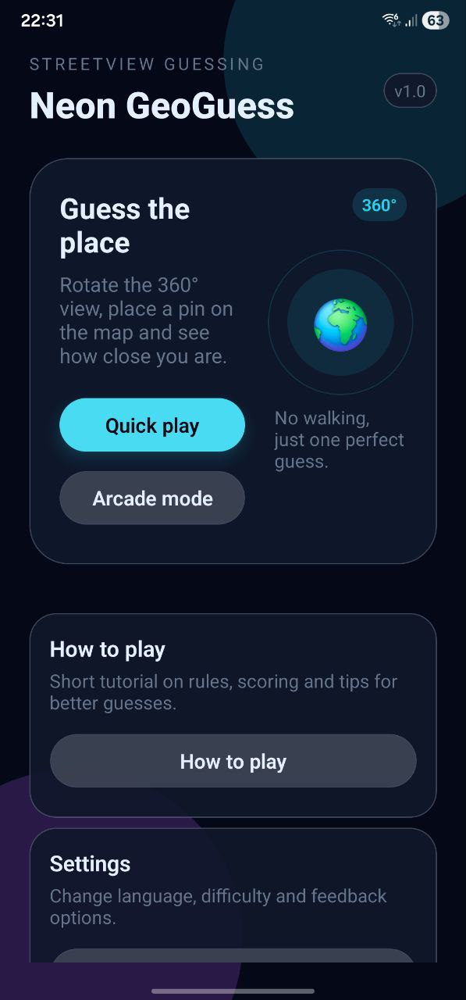
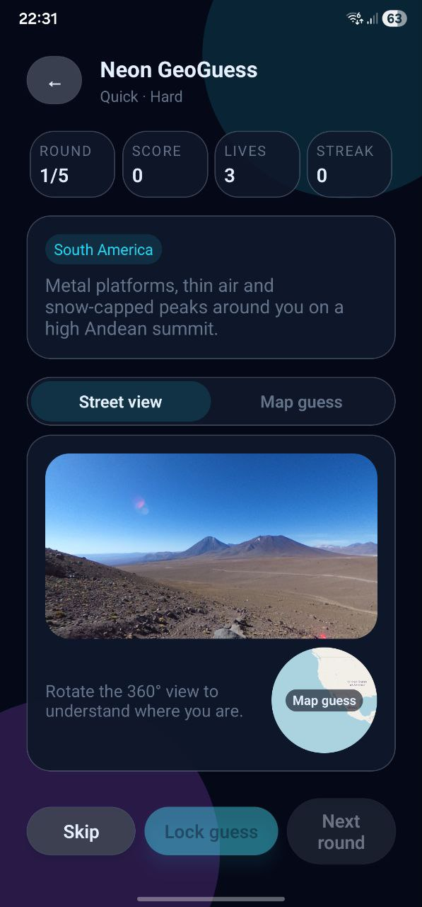
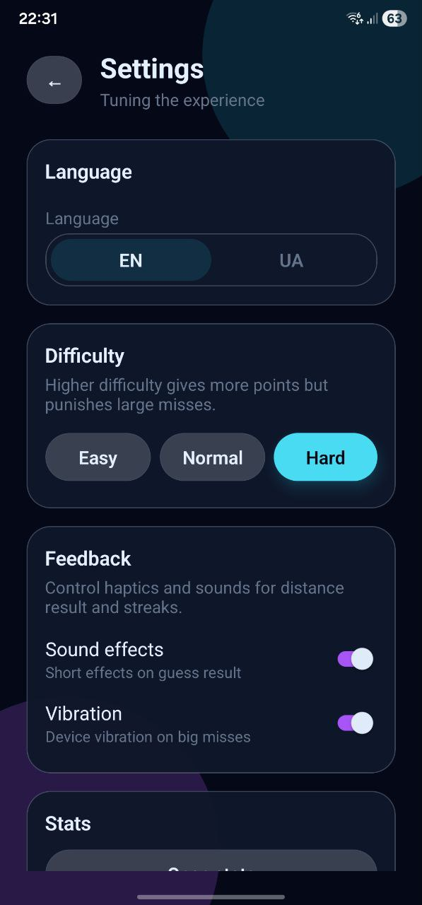

# 🌍 Neon GeoGuess

A mobile-first **streetview guessing game** built with **React Native + Expo**.  
Look around in 360°, drop a pin on the map, lock your guess and see **how close you were**.

Supports **English 🇬🇧** and **Ukrainian 🇺🇦**, has multiple game modes, animated UI and a curated list of famous locations around the world.

---

## 📸 Screenshots

| Menu | Game                   | Results |
|------|------------------------|---------|
|  |  |  |


---
## ✨ Features

### 🕹 Gameplay

- **Two game modes**
  - **Quick play** - short session (fixed number of rounds), great for demoing.
  - **Arcade mode** - timer-based, more intense; time pressure and skips affect your score.
- **360° panoramas**
  - Panoramic images from **Wikimedia Commons** and demo panoramas.
  - 360° touch / drag rotation inside a custom `PanoramaView` (WebView).
- **Map-based guessing**
  - Global map rendered via **Leaflet** inside a `WebView` (`GuessMap` component).
  - Click / tap to place a pin.
  - Scroll-wheel + pinch-zoom enabled on map for precise placement.
  - **Mini-map thumbnail** in Street View mode that jumps you to the full map on tap.
- **Distance-based scoring**
  - Score depends on **distance (km)** between guess and real location.
  - Difficulty multipliers and thresholds configured in `config/scoring`.
  - **Streaks** for consecutive good guesses.
  - Lives and time pressure in arcade mode.

### 📊 UX / UI

- **Neon dark theme** with reusable design tokens:
  - `colors`, `spacing`, `radius` in `theme.ts`.
- **Neon components**
  - `NeonScreen` - gradient background + safe area layout.
  - `NeonButton` - primary / secondary / ghost variants, disabled states.
- **Responsive layout**
  - **Menu cards** (“How to play”, “Settings”) align in a row on wider screens and stack on smaller ones without overlapping.
  - **Landscape mode** on Game screen shows full-screen panorama with a hint to rotate back to portrait to continue playing.
- **Result overlays**
  - After you lock a guess, a **result card** slides in:
    - Distance in km.
    - Verdict: Perfect / Very close / Close / Far / Very far / Timeout.
    - Points gained, current streak, difficulty.
  - Animated with `Animated` API (scale + fade).
- **End-of-game summary**
  - After a Quick-mode session:
    - Total score.
    - Average distance.
    - Best round.
    - Buttons: **Play again** / **Back to menu**.

### ⚙️ Settings & Localization

- **Language toggle** (`LanguageSwitcher`)
  - Instant switch between **EN** and **UA**.
  - All game strings go through the translation layer (`useLanguage`).
- **Difficulty**
  - Easy / Normal / Hard (affects score and punishment for big misses).
- **Feedback / accessibility**
  - Toggle **sound** for guess results.
  - Toggle **haptics / vibration** for big misses and key actions.
- **Stats & About**
  - Stats screen with best score, games played etc. (stored via `AsyncStorage`).
  - About screen with tech stack and short description of the project.

---

## 🧱 Project Structure

```text
src/
  components/
    NeonScreen.tsx
    NeonButton.tsx
    LanguageSwitcher.tsx
    PanoramaView.tsx
    GuessMap.tsx
  screens/
    MenuScreen.tsx
    GameScreen.tsx
    HowToPlayScreen.tsx
    SettingsScreen.tsx
    StatsScreen.tsx
    AboutScreen.tsx
    OnboardingScreen.tsx
    ResultsScreen.tsx
  context/
    LanguageContext.tsx
    SettingsContext.tsx
  hooks/
    useGameEngine.ts
    useStats.ts
  config/
    scoring.ts
    locations.ts
  theme.ts
  translations.ts
App.tsx
````

### 🔁 `useGameEngine` - core game logic

Encapsulates **all rules and state** for a session:

* State it manages:

   * `round`, `maxRounds`
   * `score`, `lives`, `streak`
   * `currentLocation`
   * `guessCoord` (lat / lon)
   * `distanceKm`
   * `hasGuessed`
   * `lastPoints`, `lastVerdict`
   * `wasTimeout`, `timeLeft` (arcade)
* API:

   * `handleGuessCoord(coord)`
   * `lockGuess()` - calculates distance, score, verdict.
   * `skipRound()`
   * `nextRound()` - returns `{ finished, summary? }` when game ends.
   * Internally chooses a **random location** each round from `locations` depending on difficulty and mode.

Game screens (`GameScreen`) use this hook so the UI stays clean and declarative.

### 🗺 `GuessMap` - map guessing component

* Uses `react-native-webview` to inject a small HTML page with **Leaflet**:

   * Enables `scrollWheelZoom` and `touchZoom`.
   * On click, updates a `circleMarker` and posts a message back to React Native.
* Props:

   * `onGuess({ lat, lon })`
   * `guessCoord`, `answerCoord`
   * `showAnswer` - shows answer marker + fits bounds to guess/answer.
   * `compact` - mini circular map for the Street View tab.
* Handles:

   * Network / tile load errors with a user-friendly error state + **Retry** button.
   * Web fallback: on `Platform.OS === 'web'` shows a static message instead of WebView.

### 🌀 `PanoramaView` - 360° viewer

* Also uses `react-native-webview` to render a panorama with client-side viewer (e.g. Pannellum-like).
* Receives `imageUrl` from the `locations` dataset.
* Includes:

   * Mobile-friendly control settings.
   * Fallback message if panorama fails to load (bad URL, too large, etc.).
* Only uses images that are **small enough** to fit within device GPU limits (e.g. under 16k width).

### 🎨 `MenuScreen`

* Neon header: “Neon GeoGuess”.
* Hero card:

   * Short description.
   * Quick play / Arcade mode buttons.
   * Globe illustration and “360°” pill.
* Action cards:

   * **How to play** - opens tutorial screen.
   * **Settings** - opens Settings screen.
* Language switcher + footer.

### ⚙️ `SettingsScreen`

* Difficulty buttons in a row, wrapping on small screens.
* Switches:

   * Sound on/off.
   * Vibration on/off.
* Links to:

   * Stats screen.
   * About screen.
* “Back to menu” button at the bottom.

Content is scrollable to avoid being cut off on smaller devices.

---

## 📦 Tech Stack

* **React Native + Expo**
* **TypeScript / JavaScript**
* **react-native-webview** - panoramas + Leaflet map.
* **Leaflet** - map tiles and interaction.
* **AsyncStorage** - persist basic stats / preferences.
* **Expo Haptics** (or equivalent) - vibrations.

---

## 🚀 Getting Started

### 1. Prerequisites

* **Node.js** (LTS recommended)
* **Yarn** or **npm**
* **Expo CLI** (optional, via `npm i -g expo-cli`)
* Android Studio

### 2. Clone the repo

```bash
git clone https://github.com/Antot-12/Neon-Geo-Guess.git
cd Neon-Geo-Guess
```

### 3. Install dependencies

Using Yarn:

```bash
yarn install
```

Or npm:

```bash
npm install
```

### 4. Run in development

Start the Expo dev server:

```bash
yarn start
# or
npx expo start
```

Then:

* Press **a** to open an **Android** emulator.
* Press **i** to open an **iOS** simulator (macOS only).
* Or scan the QR code with **Expo Go** on your device.

> The game is designed primarily for **portrait** orientation.

---

## 📱 Building APK / AAB

This project is designed to work with **Expo Application Services (EAS)**.

### 1. Configure EAS

Install EAS CLI if you don’t have it:

```bash
npm install -g eas-cli
```

Log in:

```bash
eas login
```

Initialize:

```bash
eas init
```

Ensure your `app.json` / `app.config.js` contains:

```jsonc
{
  "expo": {
    "name": "Neon GeoGuess",
    "slug": "neon-geoguess",
    "android": {
      "package": "com.antot_12.NeonGeoGuess",
      "versionCode": 1
    }
  }
}
```

### 2. Build for Android

```bash
eas build -p android --profile production
```

## 🌐 Data: Locations and Panoramas

All game locations live in `src/config/locations.ts`.

Each entry looks roughly like this:

```ts
{
  id: 'paris_eiffel',
  difficulty: 'easy',
  region_en: 'Europe',
  region_uk: 'Європа',
  name_en: 'Paris, France',
  name_uk: 'Париж, Франція',
  lat: 48.8584,
  lon: 2.2945,
  panoUrl: 'https://upload.wikimedia.org/...jpg',
  clue_en: 'You are near a very famous tower above a river in France...',
  clue_uk: 'Ти біля дуже відомої вежі над річкою у Франції...'
}
```

Notes:

* `panoUrl` values are picked to be:

   * Publicly accessible.
   * Not exceeding typical **GPU texture size limits** (to avoid errors like
     “This panorama is too big for your device”).
* New locations can be added as long as:

   * The image is equirectangular-compatible.
   * The host allows hotlinking.
   * File size and width are reasonable.

---

## 🧩 Known Limitations

* 🌐 **Online-only assets**

   * Panoramas and map tiles require an Internet connection.
* 📏 **Panorama size limits**

   * Extremely large source images (width > 16k) are not supported by some GPUs.
   * The dataset only uses images that are known to render on typical mobile hardware.
* 💻 **Web platform**

   * Map interactions are replaced with a fallback text on web to avoid unsupported WebView behavior.
* 📸 **Static locations**

   * Locations are hard-coded; there is no runtime download of new panoramas.

---


